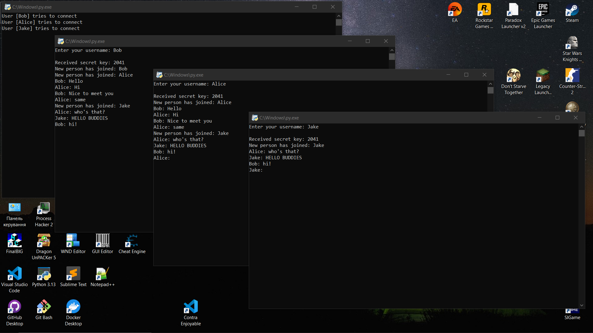

# RSA_Lab
RSA Algorithm implementation in python

## How to run & Usage example
* Run server.py first
* Open client.py and enter arbitrary name
* Check for updates in server.py terminal,
* If everything is OK you'll see a popup message
* Open another client.py and enter another name
* Now you can chat with yourself by typing messenges in each window
* NOTE: client.py interface is a little corrupted, so it might be confusing to chat here

## How it works

When a client connects to the server, it generates an RSA key pair (public and private keys). The public key is sent to the server, which uses it to securely transmit a randomly generated symmetric secret key. The client decrypts this value using its private RSA key.
This approach ensures that the shared secret is never transmitted in plain text.

# Encryption:
Once the secret key is established, all messages are encrypted using a lightweight symmetric method (XOR-based encryption). Although simple, it demonstrates the principle of symmetric encryption after a secure key exchange.

# Message Integrity / Hashing:
Before sending a message a SHA-256 hash of the original message is computed using hashlib library.
The message is encrypted. Both the hash and encrypted message are sent together.
Upon receiving the message is decrypted and new hash is computed.
The hashes are compared to verify that the message was not altered in transit.

# Server:
Accepts multiple client connections using threads (threading module).
Stores connected clients and their public keys.
Generates a single symmetric secret key and distributes it securely using RSA.
Broadcasts messages by forwarding data between clients without decrypting it.

socket — TCP communication between client and server
threading — handle multiple clients concurrently
hashlib — SHA-256 message hashing

## Tasks
- RSA for digital signature
- message integrity with hashes
- Encryption algo

## Theory:
- https://github.com/zademn/EverythingCrypto
